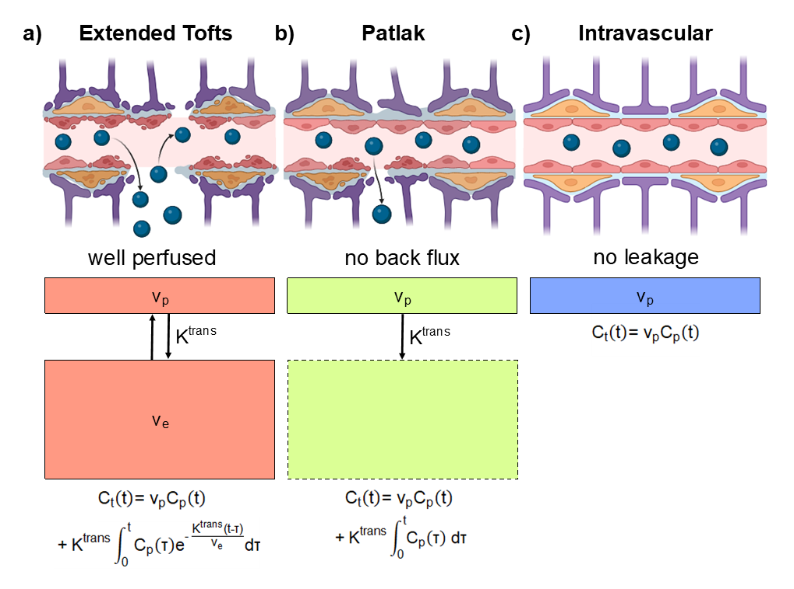

# dce_model_selection
Scripts used to perform tracer kinetic model selection on simulated and in-vivo DCE-MRI data.

All quantities, processes and model definitions are [OSIPI CAPLEX compliant](https://doi.org/10.1002/mrm.29840).1 CAPLEX definitions can be accessed by clicking on quantity, process or model hyperlinks.

---
### 1. Required software
Madym2 and Madym's Python/MATLAB wrappers are required to run these scripts and can be downloaded [here](https://gitlab.com/manchester_qbi/manchester_qbi_public/madym_cxx).

--- 
### 2. Simulating DCE-MRI signal-time curves using an existing VIF and performing model selection. 
###### Please edit the VIF file, [repetition time](https://osipi.github.io/OSIPI_CAPLEX/quantities/#TR) (TR), and [flip angle](https://osipi.github.io/OSIPI_CAPLEX/quantities/#Flip%20angle) (FA) to produce simulations mirroring your DCE-MRI acquisition. A population VIF (e.g. the [Parker AIF](https://osipi.github.io/OSIPI_CAPLEX/perfusionModels/#ParkerAIF)) could also be used.
This script is written in **Python** and does the following:
- Simulates signal time-series with user-defined scan acquisition parameters, user-defined tissue parameters, the [2CXM](https://osipi.github.io/OSIPI_CAPLEX/perfusionModels/#2CXM), and our smoothed group-averaged VIF ([the indicator concentration time-series for blood plasma](https://osipi.github.io/OSIPI_CAPLEX/quantities/#C)) from control participants. The ground-truth [PS](https://osipi.github.io/OSIPI_CAPLEX/quantities/#PS) and the amount of noise added to the curve are varied to produce a grid of noisy time series. 
  - The group-averaged VIF is provided in group_averaged_VIF.txt
  - Details of the participants and DCE-MRI acquisition parameters relating to the VIF can be found in [this paper](https://doi.org/10.3389/fphys.2020.593026)).
- Fits an [Extended Tofts model](https://osipi.github.io/OSIPI_CAPLEX/perfusionModels/#ETM) of indicator exchange, a [Patlak model](https://osipi.github.io/OSIPI_CAPLEX/perfusionModels/#Patlak) of indicator uptake, and an intravascular model (one compartment, no indicator exchange).
- Selects the best fitting model for each time-series in the grid using the [Akaike Information Criterion](https://osipi.github.io/OSIPI_CAPLEX/quantities/#AIC).
- For the grid of time-series, the following are saved in text files: best-fitting model, the fitted Ktrans, fitted vp, and if applicable, ve.
- Repeats 1000 times.

---
### 3. Pre-processing of in-vivo DCE-MRI data in MATLAB.
This script requires SPM12 (MATLAB) which can be downloaded [here](https://www.fil.ion.ucl.ac.uk/spm/docs/). 
This script is designed to process our scans (details of the data acquisition parameters can be found in [this paper](https://doi.org/10.3389/fphys.2020.593026)), and may need to be edited to be run on other DCE-MRI datasets. An example dataset can be requested by [email](olivia.jones-4@manchester.ac.uk). This script is written in **MATLAB** (required as we use SPM) and does the following:
- Averages the 2nd to 8th dynamic in the variable [prescribed flip angle](https://osipi.github.io/OSIPI_CAPLEX/quantities/#Flip%20angle) images.
- Creates a B1 map from the variable [repetition time](https://osipi.github.io/OSIPI_CAPLEX/quantities/#TR) images.
- B1-corrects the variable [prescribed flip angle](https://osipi.github.io/OSIPI_CAPLEX/quantities/#Flip%20angle) images and fits for [T1](https://osipi.github.io/OSIPI_CAPLEX/perfusionProcesses/#EstimateR10) to produce a [pre-contrast (native) T1 map](https://osipi.github.io/OSIPI_CAPLEX/perfusionProcesses/#EstimateR10).
- Realigns the dynamic [signal time-course](https://osipi.github.io/OSIPI_CAPLEX/quantities/#S) using [SPM12](https://www.fil.ion.ucl.ac.uk/spm/docs/). 

---
### 4. Fitting the models to in-vivo DCE-MRI data on HPC Cluster.
This script was used to call Madym to fit the tracer kinetic models to our data on Manchester's **[CSF3](https://research-it.manchester.ac.uk/services/the-computational-shared-facility-csf/)** and does the following:
- Fits an [Extended Tofts model](https://osipi.github.io/OSIPI_CAPLEX/perfusionModels/#ETM) of indicator exchange, a [Patlak model](https://osipi.github.io/OSIPI_CAPLEX/perfusionModels/#Patlak) of indicator uptake, and an intravascular model (one compartment, no indicator exchange) on a voxel-wise basis for all patients in Patient_IDs.txt.

---
### 5. Fitting the models to in-vivo DCE-MRI data in MATLAB. 
This script is designed to process our scans (details of the data acquisition parameters can be found in [this paper](https://doi.org/10.3389/fphys.2020.593026)), and may need to be edited to be run on other DCE-MRI datasets. An example dataset can be requested by [email](olivia.jones-4@manchester.ac.uk). This script is written in **MATLAB** and does the following:
- Fits an [Extended Tofts model](https://osipi.github.io/OSIPI_CAPLEX/perfusionModels/#ETM) of indicator exchange, a [Patlak model](https://osipi.github.io/OSIPI_CAPLEX/perfusionModels/#Patlak) of indicator uptake, and an intravascular model (one compartment, no indicator exchange) to all voxels of a single participants dataset, with participant folder name PARTICIPANT_ID_LABEL.
- Loops across participants in Participant_IDs.txt

---
### 6. Perform model selection on in-vivo DCE-MRI data in Python. 
This script is designed to process our scans (details of the data acquisition parameters can be found in [this paper](https://doi.org/10.3389/fphys.2020.593026)), and may need to be edited to be run on other DCE-MRI datasets. An example dataset can be requested by [email](olivia.jones-4@manchester.ac.uk). This script is written in **Python** and does the following:
- Loads residual maps and Ktrans maps for each model.
- Calculates the [Akaike Information Criterion](https://osipi.github.io/OSIPI_CAPLEX/quantities/#AIC) and corresponding Akaike Weights.
- Selects the best-fitting model for each voxel.
- Saves a best-fitting model map and model selection Ktrans map (where the best-fitting model's Ktrans estimate is used for each voxel). 
- Loops across participants in Participant_IDs.txt

---
### References
1. Dickie BR, Ahmed Z, Arvidsson J, et al. A community-endorsed open-source lexicon for contrast agent-based perfusion MRI: A consensus guidelines report from the ISMRM Open Science Initiative for Perfusion Imaging (OSIPI). Magn Reson Med. Published online October 13, 2023. doi:10.1002/mrm.29840
2. Berks M, Parker GJM, Little R, Cheung S. Madym: A C++ toolkit for quantitative DCE-MRI analysis. Published online 2021. https://doi.org/10.5281/zenodo.5176079
